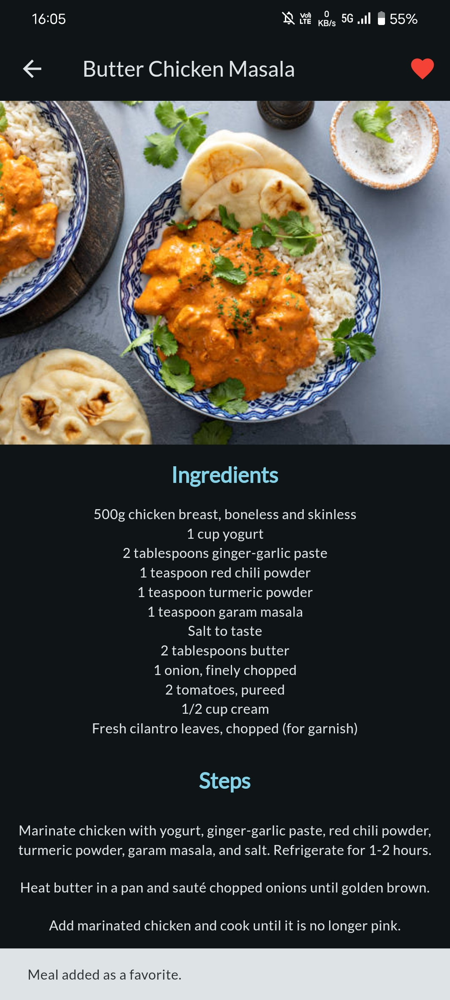
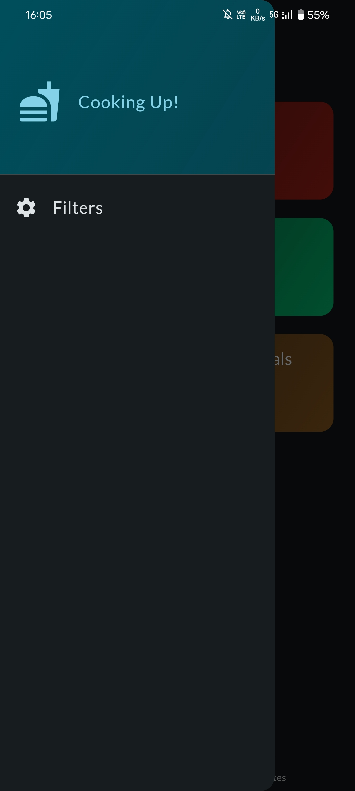
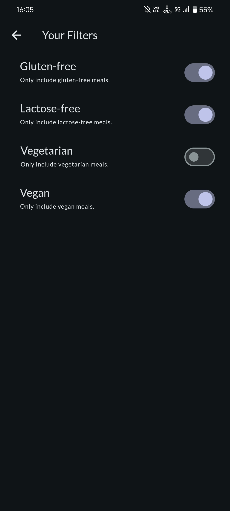

# Food Recipe App with Flutter🍕🍹

An appealing Flutter application for food enthusiasts. It showcases a variety of Indian dishes and provides detailed recipes, ingredients, and images. Users can also filter recipes based on dietary restrictions and add their favorite recipes to a favorites list. The app features a seamless user experience with a modern UI and incorporates advanced Flutter functionalities.


## Features

- **Category-Based Navigation**: Browse recipes through a visually appealing category grid.
- **Recipe Details**: View detailed information for each recipe, including images, ingredients, and step-by-step cooking instructions.
- **Favorites Management**: Add and remove recipes from a personalized favorites list with visual feedback using SnackBars.
- **Filter Options**: Apply dietary filters (Gluten-free, Lactose-free, Vegetarian, Vegan) through a side drawer for a customized recipe list.
- **Responsive Design**: Adaptive layout for different screen sizes and orientations.


## Screenshots


### Category Screen


### Meal Info Screen



### Side Drawer



### Filters Screen




## Technical Overview

### State Management
The app utilizes Provider for state management, ensuring a reactive and maintainable codebase. State changes trigger UI updates efficiently, providing a smooth user experience.

### Routing
Named routes are used for navigation within the app, managed by Navigator.pushNamed and Navigator.pop. This approach enhances the scalability of the app by keeping the navigation logic centralized and easy to maintain.

### Widgets and UI

**Custom Widgets:** The app consists of numerous custom widgets to break down the UI into reusable components, such as CategoryItem, MealItem, MealDetail, and MainDrawer.

**SnackBars:** SnackBars are implemented for providing feedback to users when they add or remove meals from their favorites list.

**Drawer:** A side drawer (MainDrawer) provides access to the filter settings, allowing users to customize their meal preferences.

**Hero widget Animations:** The app uses the Hero widget for smooth transitions between the recipe list and detailed view, providing a visually appealing experience.

**Data Handling:** Recipes and categories are defined in model classes and managed through a mock data source. Future improvements could involve integrating a backend service for dynamic content.


### Theming
A consistent dark theme is applied across the app using Flutter's theming capabilities. Custom themes are defined for primary, accent, and background colors to ensure a cohesive look and feel.


## Installation and Setup

### Prerequisites

- [Flutter SDK](https://flutter.dev/docs/get-started/install) installed on your machine.
- An editor like [Android Studio](https://developer.android.com/studio) or [Visual Studio Code](https://code.visualstudio.com/).

To run this project on your local machine, follow these steps:

1. **Clone the Repository**:
    ```bash
    git clone https://github.com/dshryn/food-recipe-app.git
    cd food-recipe-app
    ```

2. **Install Dependencies**:
    ```bash
    flutter pub get
    ```

3. **Run the App**:
    ```bash
    flutter run
    ```


## Additional Information

### Dependencies

```yaml
dependencies:
  flutter:
    sdk: flutter

  cupertino_icons: ^1.0.2
  google_fonts: ^4.0.3
  transparent_image: ^2.0.1
  flutter_riverpod: ^2.5.1
